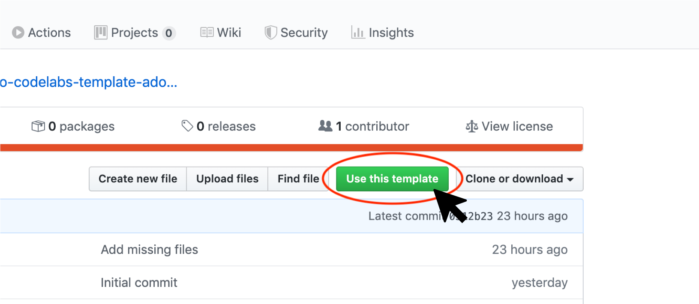
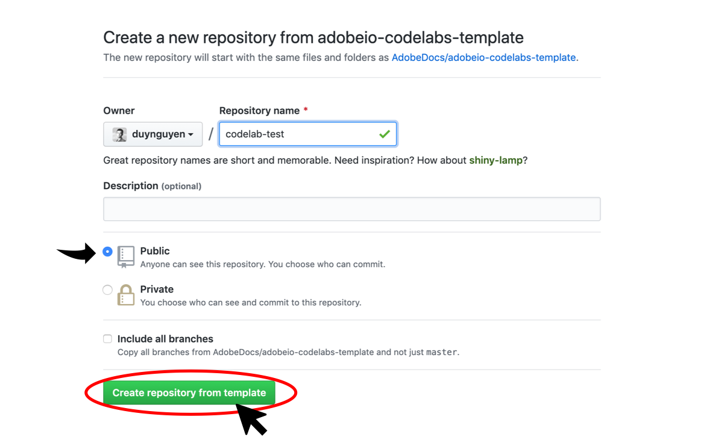

## Lesson 1: Initializing the codelab repository

To initialize a codelab repository, you should use the lab template at https://github.com/AdobeDocs/adobeio-codelabs-template.

1. Click on the "Use this template" button to create a new GitHub repository of your own codelab.

2. Select the owner of the repository, which can be your own GitHub account or an org that you own. Then give it a name and select the ... of the repo. Please note that only public repositories can be displayed on Adobe I/O Codelabs website. Click on the "Create repository from template" button to create the new repository.

3. A new repository of the codelab is then created in the GitHub account of your choice.

[Next](lesson2.md)
