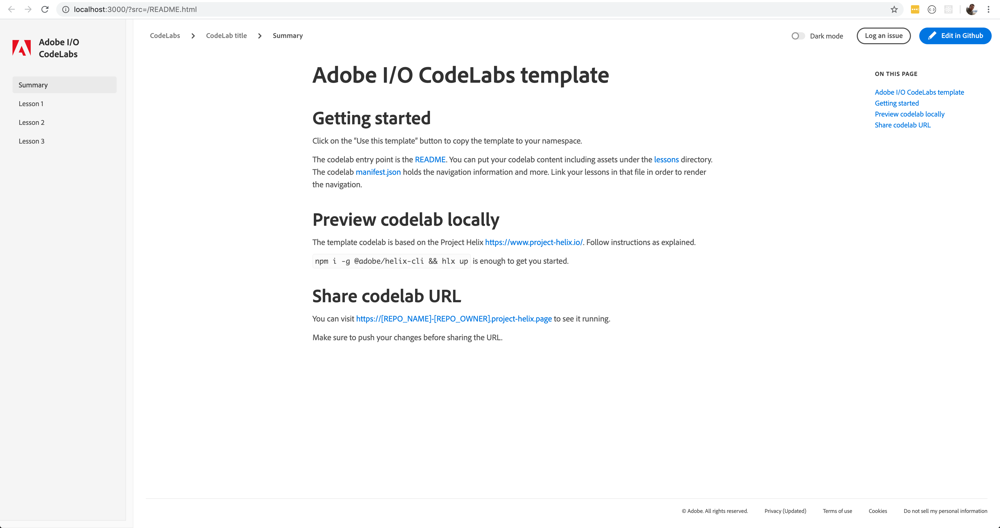

## Lesson 2: Developing Codelab Content

The codelab is written in markdown, which is used to write READMEs in GitHub repositories. If you are new to it, please visit [this markdown cheatsheet](https://github.com/adam-p/markdown-here/wiki/Markdown-Cheatsheet).  

To develop the codelab content, you first need to clone the GitHub repository to your local machine.

``` bash
git clone https://github.com/<repo-owner>/<repo-name>.git
```

The rendering of codelab is based on [Project Helix](https://www.project-helix.io/). You will need Helix CLI for local development.

```bash
npm i -g @adobe/helix-cli
```

Once Helix CLI is installed, you can run the application.

```bash
hlx up
```

You will see your codelab running at http://localhost:3000.



When you finish developing the codelab content, commit the changes to GitHub. Then you will be able to access your codelab at: `https://<repo-name>-<repo-owner>.project-helix.page`.

Next: [Publishing the codelab](/lessons/lesson3.md)
